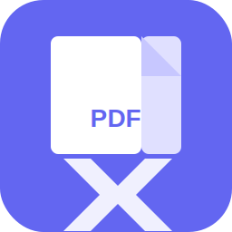

# PDF Kawankasi

<p align="center">
  
</p>

<h1 align="center">PDF Kawankasi</h1>
<p align="center"><strong>Privacy-First PDF Toolkit for Windows</strong></p>

PDF Kawankasi is a powerful Windows desktop application for manipulating, editing, merging, and processing PDF files. Built with privacy in mind - all processing happens locally on your device. No uploads, no servers, complete privacy.

---

## ✨ Features

### 🔒 Privacy First
- **100% Local Processing**: All PDF operations happen on your device
- **No Server Uploads**: Your files never leave your computer
- **No Account Required**: Start using immediately without sign-up
- **No Internet Required**: Works completely offline

### 📄 PDF Tools

#### PDF Editor
- **✏️ Advanced PDF Editor** - Full-featured PDF editor with:
  - Annotation tools (highlight, draw, text, shapes, comments, images)
  - Windows Ink support for stylus/pen input
  - Undo/Redo functionality
  - **Continuous Scrolling** - Seamlessly navigate through pages by scrolling
  - Dual page view
  - Zoom controls
  - Page thumbnails sidebar
  - Multi-tab support
  - Recent documents list

#### Popular Tools
- **Merge PDF** - Combine multiple PDFs into one file
- **Split PDF** - Extract a range of pages into a new PDF
- **Compress PDF** - Reduce file size while maintaining quality
- **JPG to PDF** - Create PDFs from JPG images
- **Extract Pages** - Save selected pages as new files
- **Delete Pages** - Remove unwanted pages
- **Rotate PDF** - Turn pages in 90-degree increments

#### Edit & Annotate
- **Page Numbers** - Add page numbers to your document
- **Watermark** - Add text or image watermarks
- **Invert Colors** - Create dark mode PDFs
- **Background Color** - Change PDF background
- **Remove Annotations** - Strip comments and highlights

#### Convert to PDF
- **Image to PDF** - Convert JPG, PNG, BMP, TIFF to PDF
- **Text to PDF** - Convert plain text files to PDF

#### Convert from PDF
- **PDF to JPG** - Export pages as JPG images
- **PDF to PNG** - Export pages as PNG images
- **PDF to Greyscale** - Convert to black and white

#### Organize & Manage
- **Add Blank Page** - Insert empty pages
- **Reverse Pages** - Flip page order
- **View Metadata** - Inspect PDF properties
- **Edit Metadata** - Modify title, author, etc.
- **Compare PDFs** - Side-by-side comparison

#### Secure PDF
- **Encrypt PDF** - Password protect your files
- **Decrypt PDF** - Remove password protection
- **Flatten PDF** - Make forms non-editable
- **Remove Metadata** - Strip hidden data

---

## 🚀 Getting Started

### System Requirements
- Windows 10 version 1809 (17763) or later
- Windows 11
- .NET 8.0 Runtime

### Installation

#### From Microsoft Store (Recommended)
1. Open Microsoft Store
2. Search for "PDF Kawankasi"
3. Click Install

#### Set as Default PDF Viewer
After installation, you can set PDF Kawankasi as your default PDF viewer:
1. Open the app
2. Go to **File** → **Register as Default PDF Viewer**
3. Windows Settings will open where you can select PDF Kawankasi for .pdf files
4. Once set, double-clicking any PDF file in File Explorer will open it in PDF Kawankasi

#### Build from Source
```bash
# Clone the repository
git clone https://github.com/Han-Anonymous/bentopdf.git
cd bentopdf/PDFKawankasi

# Restore dependencies
dotnet restore

# Build the application
dotnet build

# Run the application
dotnet run --project PDFKawankasi/PDFKawankasi.csproj
```

---

## 🛠️ Development

### Prerequisites
- Visual Studio 2022 or later
- .NET 8.0 SDK
- Windows 10/11 SDK

### Project Structure
```
PDFKawankasi/
├── PDFKawankasi.sln           # Solution file
└── PDFKawankasi/
    ├── Assets/                 # App icons and images
    ├── Converters/            # XAML value converters
    ├── Models/                # Data models
    ├── Properties/            # App properties
    ├── Resources/             # XAML styles and colors
    ├── Services/              # PDF processing services
    ├── ViewModels/            # MVVM view models
    ├── Views/                 # XAML views
    ├── App.xaml               # Application definition
    ├── app.manifest           # Windows manifest
    ├── Package.appxmanifest   # MSIX package manifest
    └── PDFKawankasi.csproj    # Project file
```

### Key Technologies
- **WPF** - Windows Presentation Foundation for UI
- **.NET 8.0** - Latest .NET runtime
- **CommunityToolkit.Mvvm** - MVVM architecture support
- **PdfSharpCore** - PDF manipulation library
- **iText7** - Advanced PDF operations
- **SixLabors.ImageSharp** - Image processing

---

## 📦 Publishing to Microsoft Store

### Create MSIX Package

1. Open the solution in Visual Studio
2. Right-click on the project → Publish → Create App Packages
3. Select "Microsoft Store" as the distribution method
4. Follow the wizard to create your package

**For local testing and sideloading:**
```powershell
# Sign with self-signed certificate (fixes error 0x800B010A)
.\scripts\Sign-MSIX.ps1 -MsixPath "path\to\package.msix"

# Install
Add-AppxPackage -Path "path\to\package.msix"
```

See [MSIX_SIDELOADING_GUIDE.md](MSIX_SIDELOADING_GUIDE.md) for detailed sideloading instructions.

### Store Submission

1. Go to [Partner Center](https://partner.microsoft.com/)
2. Create a new app submission
3. Upload your MSIX package
4. Fill in the store listing information
5. Submit for certification

**Documentation:**
- [MSIX_SIDELOADING_GUIDE.md](MSIX_SIDELOADING_GUIDE.md) - **Local testing with self-signed certificates**
- [MICROSOFT_STORE_SUBMISSION.md](MICROSOFT_STORE_SUBMISSION.md) - Complete Store submission guide
- [MSIX_BUILD_GUIDE.md](MSIX_BUILD_GUIDE.md) - Building MSIX packages
- [QUICK_START_MSIX.md](QUICK_START_MSIX.md) - Quick reference

---

## 🔐 Privacy & Security

PDF Kawankasi is designed with privacy as a core principle:

- ✅ **No data collection** - We don't collect any user data
- ✅ **No analytics** - No tracking or telemetry
- ✅ **No network requests** - App works completely offline
- ✅ **No file uploads** - All processing is local
- ✅ **Open source** - Fully auditable code

---

## 📄 License

This project is licensed under the Apache 2.0 License - see the [LICENSE](../LICENSE) file for details.

---

## 🤝 Contributing

Contributions are welcome! Please feel free to submit a Pull Request.

1. Fork the repository
2. Create your feature branch (`git checkout -b feature/AmazingFeature`)
3. Commit your changes (`git commit -m 'Add some AmazingFeature'`)
4. Push to the branch (`git push origin feature/AmazingFeature`)
5. Open a Pull Request

---

## 📞 Support

- **Issues**: [GitHub Issues](https://github.com/Han-Anonymous/bentopdf/issues)
- **Discussions**: [GitHub Discussions](https://github.com/Han-Anonymous/bentopdf/discussions)

---

## 🙏 Acknowledgments

- Based on [BentoPDF](https://github.com/alam00000/bentopdf) web application
- Built with [PdfSharpCore](https://github.com/ststeiger/PdfSharpCore)
- Uses [iText7](https://github.com/itext/itext7-dotnet) for advanced PDF operations
- Icons from [Lucide](https://lucide.dev/)

---

<p align="center">Made with ❤️ for PDF lovers everywhere</p>
